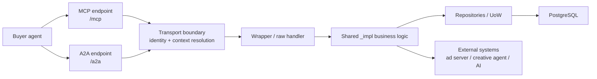
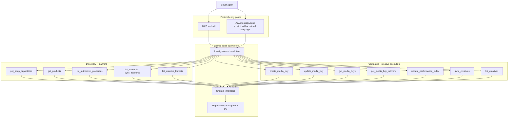
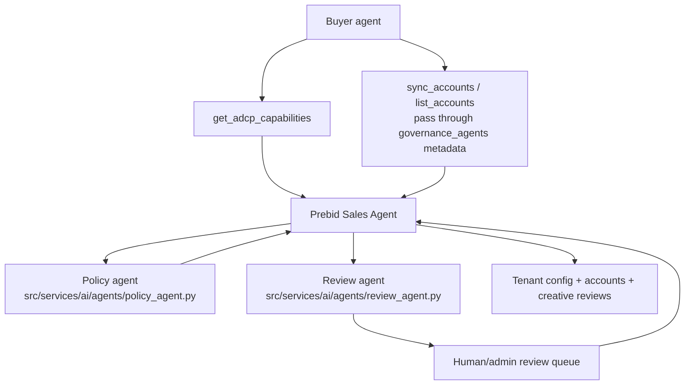
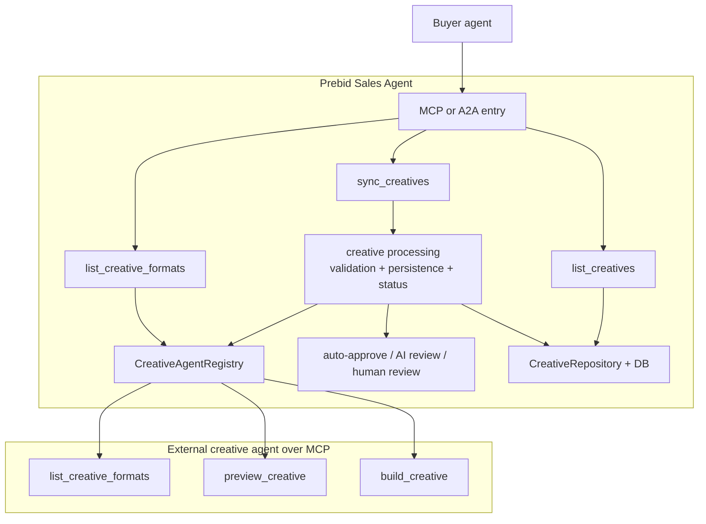
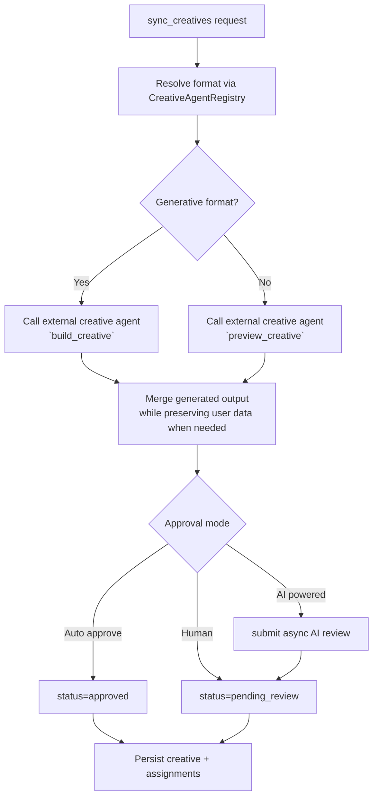
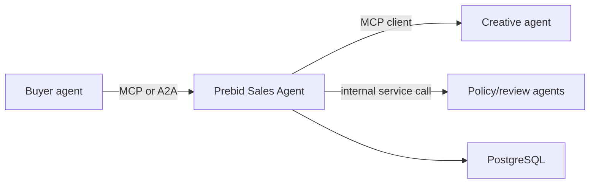

# A2A and MCP Agent Flows

This guide shows how the Prebid Sales Agent behaves on the protocol side for the three flows people usually ask about:
- buyer agent flows
- governance-related flows
- creative flows

The diagrams below are based on the current implementation in:
- `src/core/main.py`
- `src/core/mcp_auth_middleware.py`
- `src/a2a_server/adcp_a2a_server.py`
- `src/core/creative_agent_registry.py`
- `src/core/tools/creatives/`
- `src/services/ai/agents/`

## 1. Protocol Overview

### What changes by protocol

- `MCP`: `MCPAuthMiddleware` resolves identity once, stores `identity` and optional `context_id`, then the MCP tool wrapper calls the shared implementation.
- `A2A`: `AdCPRequestHandler` resolves identity once, builds task/context metadata, then dispatches the explicit skill handler to the corresponding raw function or shared implementation.
- `Shared core`: business behavior is intended to stay in `_impl` functions so MCP and A2A stay aligned.

## 2. Buyer Agent Flow

### Buyer flow across MCP and A2A

### Buyer-facing tools available now

These are the tools actually registered on the MCP server in `src/core/main.py` and used by the A2A server skill handlers:

| Area | Tools |
| --- | --- |
| Discovery | `get_adcp_capabilities`, `get_products`, `list_authorized_properties`, `list_accounts`, `sync_accounts`, `list_creative_formats` |
| Media buy lifecycle | `create_media_buy`, `update_media_buy`, `get_media_buys`, `get_media_buy_delivery`, `update_performance_index` |
| Creative library | `sync_creatives`, `list_creatives` |
| Task management | `list_tasks`, `get_task`, `complete_task` on MCP only |

### A2A note

The A2A agent card currently advertises a few extra skills such as `approve_creative`, `get_media_buy_status`, and `optimize_media_buy`, but those are not fully implemented in the current request handler path. For the diagrams above, the "available now" list reflects the working tool path rather than every advertised skill.

## 3. Governance Flow

### Current governance reality

The codebase has governance-related concepts, but not a full public governance protocol surface yet.

- `get_adcp_capabilities` reports `supported_protocols=["media_buy"]`
- `media_buy.features.content_standards` is currently `false`
- account `governance_agents` are stored and passed through, but there is no implemented governance MCP/A2A toolset yet
- governance today mainly shows up as internal policy checks and review workflows, not as a separate buyer-facing governance agent API

### Governance flow as implemented today

### Governance-related tools available per agent

| Agent | Tools available now |
| --- | --- |
| Buyer agent talking to sales agent | `get_adcp_capabilities`, `list_accounts`, `sync_accounts` |
| Sales agent public governance API | None yet for dedicated governance/content-standards management |
| Internal governance helpers | Policy analysis and creative review agents are internal service components, not MCP/A2A tools |

### What the governance path is doing today

- Discovery tells the buyer what is and is not supported.
- Account sync can carry `governance_agents` metadata through storage.
- Creative review can invoke internal AI review or human review, which is governance-adjacent but not a standalone governance protocol implementation.

## 4. Creative Flow

### Creative protocol flow

### Creative decision flow inside `sync_creatives`

### Creative tools available per agent

| Agent | Tools available now |
| --- | --- |
| Buyer agent talking to sales agent | `list_creative_formats`, `sync_creatives`, `list_creatives` |
| Sales agent talking to external creative agent | `list_creative_formats` via AdCP client, plus MCP-only `preview_creative` and `build_creative` for non-standard creative-agent features |
| Internal review/governance helpers | AI review is internal service logic, not a public MCP/A2A tool |

## 5. Quick Agent Map

## 6. Practical Summary

- The buyer agent primarily interacts with one public agent: the Prebid Sales Agent.
- MCP and A2A are two protocol wrappers around the same intended business logic.
- Creative flows are the richest multi-agent path today because the sales agent actively calls external creative agents.
- Governance is partially represented in metadata, policy checks, and review workflows, but not yet exposed as a full buyer-facing governance MCP/A2A protocol domain.
